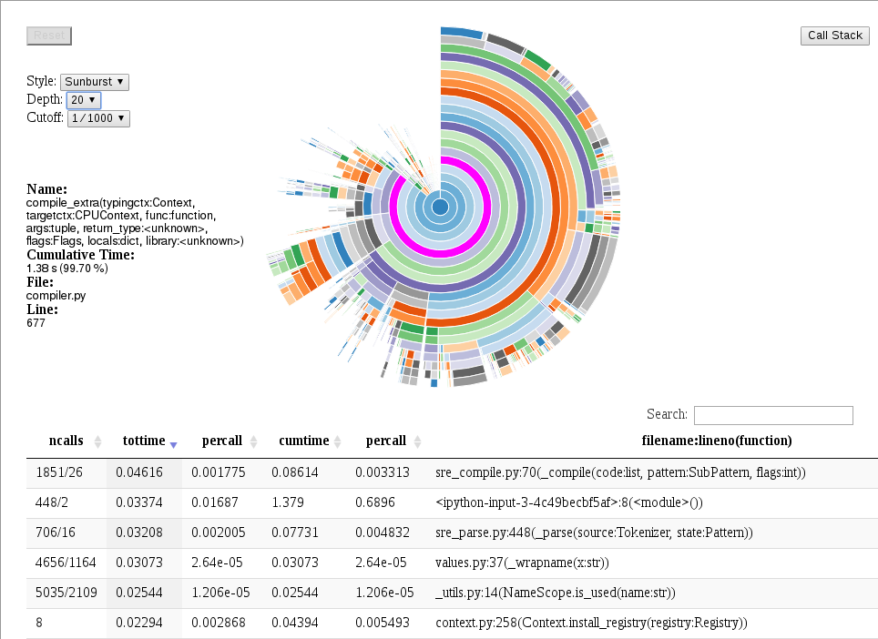

=========
Profiling
=========

The Python standard library includes code profiling functionality.
When active, function invocations and the time spent on them are recorded.

The ``data_profiler`` module extends this functionality by also recording the
functions' signatures, which are useful because often the precise control flow
--and thus function performance-- depends on the argument types. For NumPy
array types, this includes not only the ``dtype`` attribute, but also the
array's shape.

Profiling example
=================

The following code defines a simple dot function (in a file called ``dot.py``
and profiles it without signatures to match the behaviour of the Python
standard library profile module:

.. code-block:: python

  import data_profiler as profiler
  import numpy as np

  def dot(a, b):
    sum=0
    for i in range(len(a)):
        sum += a[i]*b[i]
    return sum

  a = np.arange(16, dtype=np.float32)
  b = np.arange(16, dtype=np.float32)

  p = profiler.Profile(signatures=False)
  p.enable()
  dot(a, b)
  p.disable()
  p.print_stats()

This generates the following output:

.. code-block:: python

         3 function calls in 0.000 seconds

   Ordered by: standard name

   ncalls  tottime  percall  cumtime  percall filename:lineno(function)
        1    0.000    0.000    0.000    0.000 builtins.len
        1    0.000    0.000    0.000    0.000 dot.py:7(dot)
        1    0.000    0.000    0.000    0.000 {method 'disable' of 'prof.Profiler' objects}

By default, the ``Profile`` constructor's ``signature`` flag is set to ``True``,
making this change results in the following output:

.. code-block:: python

         3 function calls (2 primitive calls) in 0.000 seconds

   Ordered by: standard name

   ncalls  tottime  percall  cumtime  percall filename:lineno(function)
        1    0.000    0.000    0.000    0.000 dot.py:1(disable())
      2/1    0.000    0.000    0.000    0.000 dot.py:7(dot(a:ndarray(dtype=float32, shape=(16,)), b:ndarray(dtype=float32, shape=(16,))))

In the case of more realistic code, the call graph (and subsequently the table
of function calls) is typically much bigger. This can make working with data in
tabular form inconvenient. To solve this issue, the ``data_profiler`` module
provides functionality to visualize the data by calling the
``data_profiler.plot()`` function in place of the ``print_stats()``
method.

NOTE: At this time, the ``data_profiler.plot()`` function may only be called
from inside a notebook.

If the code above was executed from inside a notebook, run the following code:

.. code-block:: python

  In [3]: plot(p)

Which generates the following output:

data_profiler.profiler API
==========================

.. autoclass:: data_profiler.profile.Profile
   :members: print_stats
   :inherited-members: __init__

.. autofunction:: data_profiler.plot
